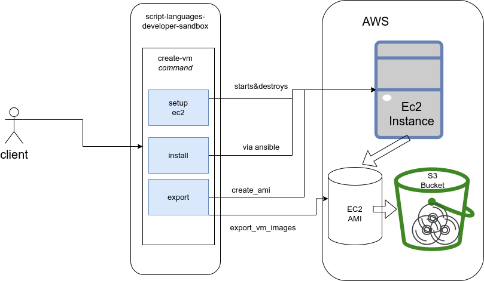
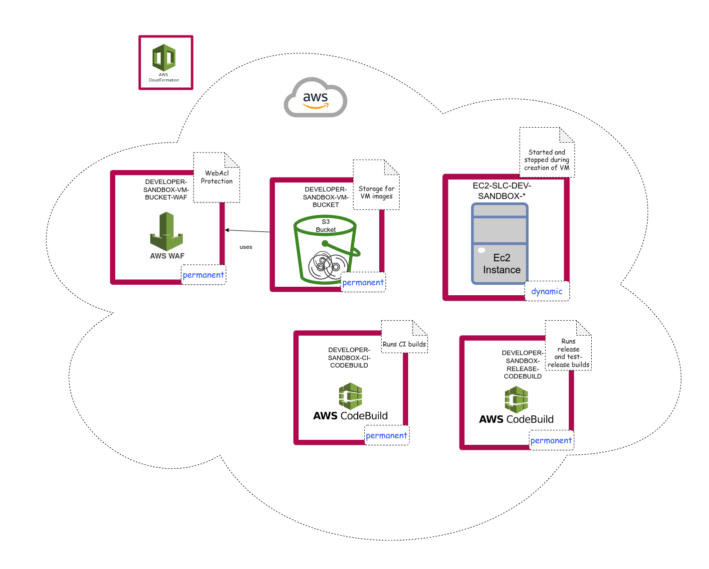

## Tagged Release Workflow

1. Take care to update latest file `doc/changes/changes_*.md`
   * Correct version number
   * Current date
   * Code name
   * Summary
   * Remove sections without tickets or add `n/a`
2. Open a pull request and let the PR CI validate the release version through the `Check Version Number` step in [.github/workflows/ci.yaml](https://github.com/exasol/ai-lab/blob/main/.github/workflows/ci.yaml)
3. Merge the pull request
4. Push the release version tag
5. The tagged `Release` GitHub Actions workflow authenticates to AWS via GitHub OIDC, runs `ai-lab release check`, `build`, `notes`, and `publish`, builds the AMI and VM artifacts, and publishes the Docker release image for that tag

## AWS Infrastructure Workflow

The following diagram shows the high-level steps to generate the images:



### Setup EC2

Creates an EC2 instance based on an Ubuntu AMI via AWS Cloudformation. It also creates a new keypair dynamically.
After the export has finished, the cloudformation stack and the keypair is removed.

### Install

Installs all dependencies via Ansible:
* installs and configures Jupyter
* installs Docker and adds the user `jupyter` to the docker group
* changes the netplan configuration. This is necessary to have proper network configuration when running the VM image

Finally, the default password will be set, and also the password will be marked as expired, such that the user will be forced to enter a new password during initial login.
Also, the ssh password authentication will be enabled, and for security reasons the folder "~/.ssh" will be removed.

### Export

The export creates an AMI based on the running EC2 instance and exports the AMI as VM image in the default formats to a S3 bucket.

## Release

The release now runs in GitHub Actions. PR CI validates the release version, while the AWS-backed CI tests and the
tagged `Release` workflow both authenticate to AWS via OIDC, run the release workflow commands, build the AMI and VM
artifacts, and publish the Docker image.

Manual `workflow_dispatch` runs are treated as draft test releases: they still generate release notes and a draft GitHub
release, but they do not make the AMI public or publish the Docker image.

### IAM permissions for GitHub Actions

The AWS-backed CI and the tagged release workflow both authenticate to AWS via GitHub OIDC. The CI role should get the
shared permission block below, and the release role should get the same block plus one additional release-only
permission.

The release workflow also requests a 5-hour OIDC session from `aws-actions/configure-aws-credentials` so the long
running test release can complete stack cleanup before the temporary credentials expire. The CI workflow uses a
shorter session because it finishes much faster.

Shared permissions used by AWS CI and release:

```json
{
  "Version": "2012-10-17",
  "Statement": [
    {
      "Sid": "SharedCiAndReleasePermissions",
      "Effect": "Allow",
      "Action": [
        "logs:*",
        "cloudformation:CreateChangeSet",
        "cloudformation:DescribeChangeSet",
        "cloudformation:ExecuteChangeSet",
        "cloudformation:ValidateTemplate",
        "cloudformation:ListStackResources",
        "cloudformation:ListStacks",
        "cloudformation:DescribeStacks",
        "cloudformation:DeleteStack",
        "ec2:RunInstances",
        "ec2:CreateKeyPair",
        "ec2:DeleteKeyPair",
        "ec2:CreateSecurityGroup",
        "ec2:AuthorizeSecurityGroupIngress",
        "ec2:DeleteSecurityGroup",
        "ec2:TerminateInstances",
        "ec2:CreateTags",
        "ec2:DescribeInstances",
        "ec2:DescribeSecurityGroups",
        "ec2:DescribeImages",
        "ec2:DescribeInstanceStatus",
        "ec2:DescribeSnapshots",
        "ec2:DescribeExportImageTasks",
        "ec2:DescribeKeyPairs",
        "ec2:CreateImage",
        "ec2:ExportImage",
        "ec2:DeregisterImage",
        "ec2:DeleteSnapshot",
        "s3:ListBucket",
        "s3:GetObject",
        "s3:PutObject",
        "s3:DeleteObject"
      ],
      "Resource": "*"
    }
  ]
}
```

These EC2 permissions are required because CloudFormation executes the stack directly and creates the EC2 instance and
security group on behalf of the GitHub Actions role.

Release-only permission:

```json
{
  "Version": "2012-10-17",
  "Statement": [
    {
      "Sid": "ReleaseOnlyPermissions",
      "Effect": "Allow",
      "Action": [
        "ec2:ModifyImageAttribute"
      ],
      "Resource": "*"
    }
  ]
}
```

`AWS_USER_NAME` is only a workflow input used to label AWS resources created by the build. It is not an IAM
authorization mechanism.

## AWS S3 Bucket

The bucket has private access. In order to control access, the Bucket cloudformation stack also contains a Cloudfront distribution. Public Https access is only possibly through Cloudfront. Another stack contains a Web application firewall (WAF), which will be used by the Cloudfront distribution. Due to restrictions in AWS, the WAF stack needs to be deployed in region "us-east-1". The WAF stack provides two rules which aim to minimize a possible bot attack:

| Name                 | Explanation                                                                               | Priority |
|----------------------|-------------------------------------------------------------------------------------------|----------|
| VMBucketRateLimit    | Declares the minimum possible rate limit for access: 100 requests in a 5 min interval.    | 0        |
| CAPTCHA              | Forces a captcha action for any IP which does not match a predefined set of IP-addresses. | 1        |

## Involved Cloudformation stacks

The following diagram shows the involved cloudformation stacks:


The following resources are permanent and need to be deployed using the "deploy" [commands](commands.md#deployment-commands):
* `DATA-SCIENCE-SANDBOX-VM-Bucket`
* `DATA-SCIENCE-SANDBOX-CI-TEST-CODEBUILD`

The EC2-stack lives only during the creation of a new sandbox image.

## Tagging AWS Resources

Each of the involved resources might cause costs: cloudformation stacks, AMI, EC2 key-pairs.

To enable keeping track of all these resources, the implementation tags them after creation with a specific keyword (called __asset-id__).

The S3 objects are identified by the prefix in the S3 bucket.

The command tags only the dynamically created entities with the *asset-id* but not the permanent cloudformation stacks.

The command `show-aws-assets` lists all assets which were created during the execution.
* This is very useful if an error occured.
* If the creation of a sandbox finished normally the list should contain only the AMI, images (S3 objects) and the export tasks (one for each image).
