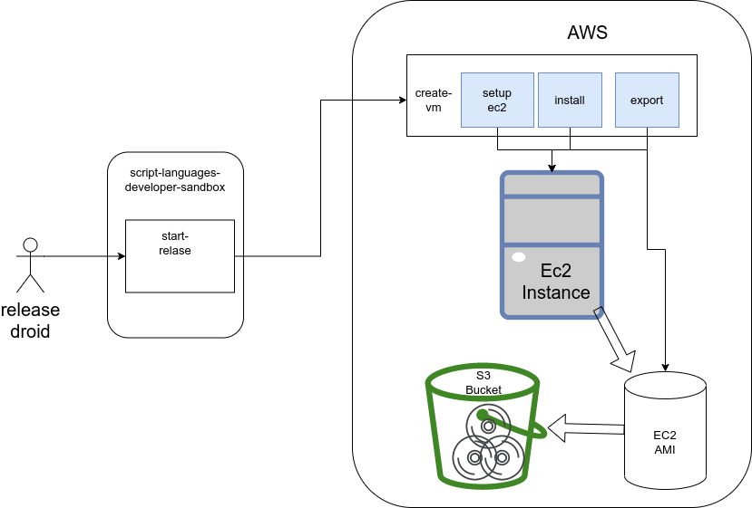
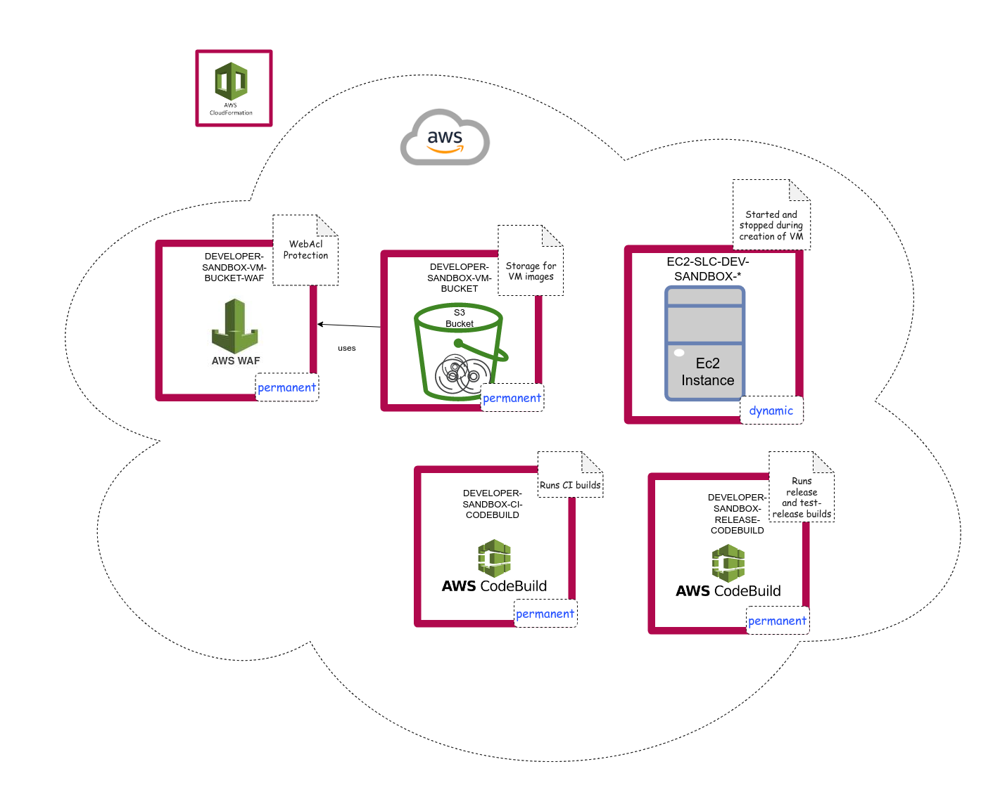

## AWS Build and Release Workflow

The following diagram shows the high-level steps to generate the images:


### Setup EC2

Creates an EC2 instance based on an Ubuntu AMI via AWS Cloudformation. It also creates a new keypair dynamically.
After the export has finished, the cloudformation stack and the keypair is removed.

### Install

Installs all dependencies via Ansible:
* installs Poetry
* installs and configures Jupyter
* installs Docker and adds the user `ubuntu` to the docker group
* clones the script-languages-release repository
* changes the netplan configuration. This is necessary to have proper network configuration when running the VM image

Finally, the default password will be set, and also the password will be marked as expired, such that the user will be forced to enter a new password during initial login.
Also, the ssh password authentication will be enabled, and for security reasons the folder "~/.ssh" will be removed.

### Tests

XAL comes with a number of tests in directory `test`. Besides unit and integrations tests in the respective directories there are tests in directory `codebuild`, see [Executing AWS CodeBuild](#executing-aws-codebuild).  To run these tests manually please use
 ```shell export DSS_RUN_CI_TEST=true; poetry run test/codebuild/test_ci.py  ```

Creating a docker image is quite time-consuming, currently around 7 minutes. In order to use an existing docker image in the tests in `integration/test_create_dss_docker_image.py` simply add CLI option `--dss-docker-image` when calling `pytest`:

 ```shell  poetry run pytest --dss-docker-image exasol/data-science-sandbox:0.1.0  ```

#### Executing tests involving AWS resources

In AWS web interface, IAM create an access key for CLI usage and save or download the *access key id* and the *secret access key*.

In file `~/.aws/config` add lines
```
[profile dss_aws_tests]
region = eu-central-1
```

In file `~/.aws/credentials` add
```
[dss_aws_tests]
aws_access_key_id=...
aws_secret_access_key=...
```

In case your are using MFA authentication please allocate a temporary token.

After that you can set an environment variable and execute the tests involving AWS resources:

```shell
export AWS_PROFILE=dss_aws_tests_mfa
poetry run pytest test/test_deploy_codebuild.py
```

#### Executing tests involving Ansible

For making pytest display Ansible log messages, please use

```shell
poetry run pytest -s -o log_cli=true -o log_cli_level=INFO
```

### Ansible packages

The packages to be installed by Ansible are using pinned versions, e.g. for [poetry](../../exasol/ds/sandbox/runtime/ansible/roles/poetry/defaults/main.yml).

In case ansible reports "no available installation candidate" for a specific version of a package, please search for newer versions of the package on https://packages.ubuntu.com/.

If the update is very new and not yet displayed on packages.ubuntu.com you can use

```shell
apt-get update
apt-search <package>
```

### Export

The export creates an AMI based on the running EC2 instance and exports the AMI as VM image in the default formats to a S3 bucket.

## Release

The release is executed in a AWS Codebuild job, the following diagram shows the flow.



## AWS S3 Bucket

The bucket has private access. In order to control access, the Bucket cloudformation stack also contains a Cloudfront distribution. Public Https access is only possibly through Cloudfront. Another stack contains a Web application firewall (WAF), which will be used by the Cloudfront distribution. Due to restrictions in AWS, the WAF stack needs to be deployed in region "us-east-1". The WAF stack provides two rules which aim to minimize a possible bot attack:

| Name                 | Explanation                                                                               | Priority |
|----------------------|-------------------------------------------------------------------------------------------|----------|
| VMBucketRateLimit    | Declares the minimum possible rate limit for access: 100 requests in a 5 min interval.    | 0        |
| CAPTCHA              | Forces a captcha action for any IP which does not match a predefined set of IP-addresses. | 1        |

## Involved Cloudformation stacks

The following diagram shows the involved cloudformation stacks:


The following resources are permanent and need to be deployed using the "deploy" [commands](#deployment-commands):
* `DATA-SCIENCE-SANDBOX-VM-Bucket`
* `DATA-SCIENCE-SANDBOX-CI-TEST-CODEBUILD`
* `DATA-SCIENCE-SANDBOX-RELEASE-CODEBUILD`

The EC2-stack lives only during the creation of a new sandbox image.

## Tagging

Each of the involved resources might cause costs: cloudformation stacks, AMI, EC2 key-pairs.

To enable keeping track of all these resources, the implementation tags them after creation with a specific keyword (called __asset-id__).

The S3 objects are identified by the prefix in the S3 bucket.

The command tags only the dynamically created entities with the *asset-id* but not the permanent cloudformation stacks.

The command `show-aws-assets` lists all assets which were created during the execution.
* This is very useful if an error occured.
* If the creation of a sandbox finished normally the list should contain only the AMI, images (S3 objects) and the export tasks (one for each image).

## How to contribute

The project has two types of CI tests:
* unit tests and integration tests which run in a Github workflow
* A system test which runs on a AWS Codebuild

Both ci tests need to pass before the approval of a Github PR.
The Github workflow will run on each push to a branch in the Github repository. However, the AWS Codebuild will only run after you push a commit containing the string "[CodeBuild]" in the commit message, see [Executing AWS CodeBuild](#executing-aws-codebuild).

## Executing AWS CodeBuild

Use the following git commands to execute the AWS CodeBuild script:
```shell
git commit -m "[CodeBuild]" --allow-empty && git push
```

This will trigger a webhook that was installed by an AWS template into the git-Repository.
* The webhook is defined in file `exasol/ds/sandbox/templates/ci_code_build.jinja.yaml`
* and calls `aws-code-build/ci/buildspec.yaml`
* which then executes `test/codebuild/test_ci*.py`

The CodeBuild will take about 20 minutes to complete.
