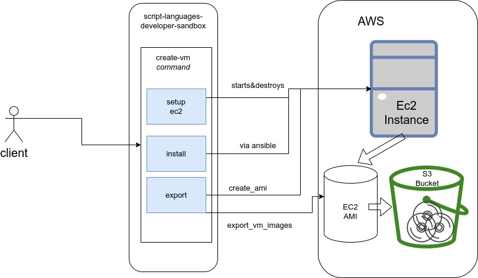
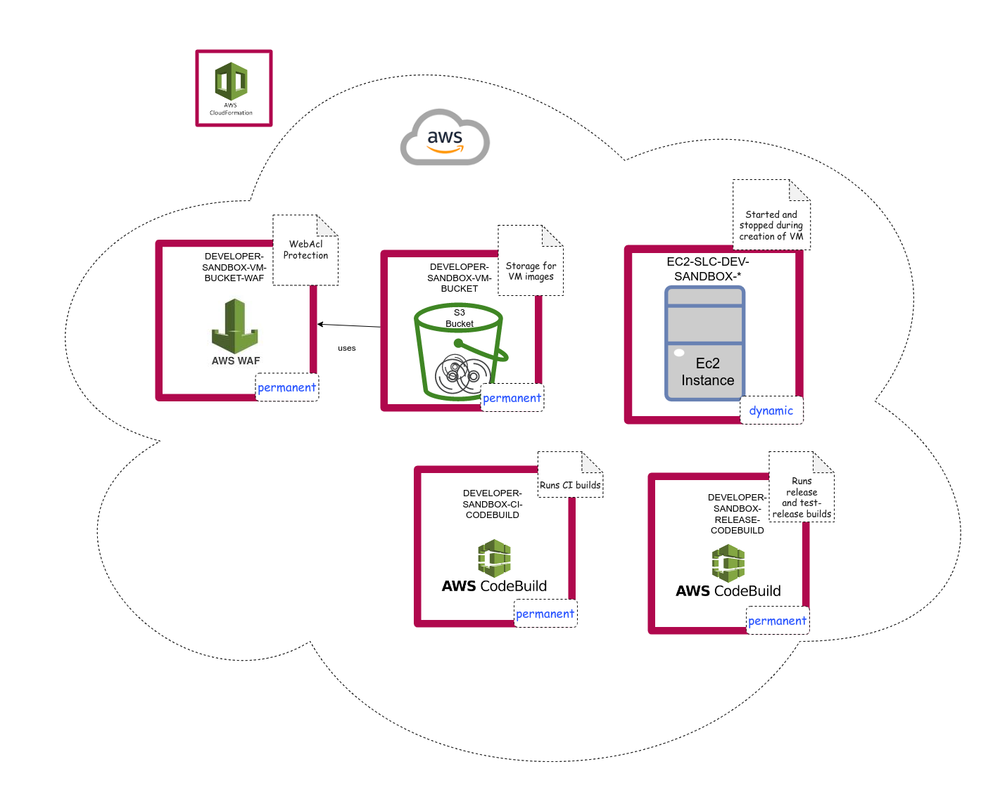

# Exasol AI-Lab Developer Guide

## Overview

The overall idea of this project is to set-up an AWS EC-2 instance, using cloudformation templates, then install all dependencies via _Ansible_, generate an AMI image based on the final EC-2 instance, and finally export the AMI image to the virtual image formats.

## Requirements

This package requires:
* Python (>=3.8)
* Poetry (>=1.2.0)
* Docker (for integration tests)
* AWS CLI

## Setup

### Install githooks

Run the following command before development.

```shell
cd githooks
bash install.sh
```

## Design Goals

The Exasol AI-Lab (XAL) uses AWS as backend, because it provides the possibility to run the whole workflow during a ci-test.

This project uses
* `boto3` to interact with AWS
* `pygithub` to interact with the Github releases
* `ansible-runner` to interact with Ansible.
Proxy classes to those projects are injected at the CLI layer. This allows to inject mock classes in the unit tests.
A CLI command has normally a respective function in the `lib` submodule. Hence, the CLI layer should not contain any logic, but invoke the respective library function only. Also, the proxy classes which abstract the dependant packages shall not contain too much logic. Ideally they should invoke only one function to the respective package.


## Commands

The commands offered by the XAL CLI can be organized into three groups:

| Group                | Usage                                   |
|----------------------|-----------------------------------------|
| Release Commands     | during the release                      |
| Deployment Commands  | to deploy infrastructure onto AWS cloud |
| Development Commands | to identify problems or for testing     |

### Release commands

The following commands are used during the release AWS Codebuild job:
* `create-vm`: Create a new AMI and VM images.
* `update-release`: Update release notes of an existing Github release.
* `start-release-build`: Start the release on AWS codebuild.
* `create-docker-image`: Create a Docker image for ai-lab and deploy it to hub.docker.com/exasol/ai-lab.

Script `start-release-build`:
* Is usually called from github workflow `release_droid_upload_github_release_assets.yml`.
* Requires environment variable `GH_TOKEN` to contain a valid token for access to Github.
* Requires to specify CLI option `--upload-url`.

This operation usually takes around than 1:40 hours.

### Developer commands

All other commands provide a subset of the features of the release commands, and can be used to identify problems or simulate the release:
* `export-vm`: Create a new VM image from a running EC2-Instance.
* `install-dependencies`: Start an ansible-installation onto an existing EC-2 instance.
* `reset-password`: Reset password on a remote EC-2-instance via ansible.
* `setup-ec2`: Start a new EC2 instance (based on an Ubuntu AMI).
* `setup-ec2-and-install-dependencies`: Start a new EC2 instance and install dependencies via Ansible.
  * The script will print the required SSH login for manual inspection or interaction with the EC2 instance.
  * The instance is kept running until the user presses Ctrl-C.
* `show-aws-assets`: Show AWS entities associated with a specific keyword (called __asset-id__).
* `start-test-release-build`: (For testing) Creates a release on Github and forwards it to the AWS Codebuild which creates VM images in various formats and attaches them to the Github release.
* `make-ami-public`: Change permissions of an existing AMI such that it becomes public.

Script `start-test-release-build` requires environment variable `GH_TOKEN` to contain a valid token for access to Github.

### Deployment commands

The following commands can be used to deploy the infrastructure onto a given AWS account:
* `setup-ci-codebuild`: Deploy the AWS Codebuild cloudformation stack which will run the ci-test.
* `setup-vm-bucket`: Deploy the AWS Bucket cloudformation stack which will be used to deploy the VM images.
* `setup-release-codebuild`: Deploy the AWS Codebuild cloudformation stack which will be used for the release-build.
* `setup-vm-bucket-waf`: Deploy the AWS Codebuild cloudformation stack which contains the WAF Acl configuration for the Cloudfront distribution of the VM Bucket.

For all deployment commands:
* Don't forget to specify CLI option `--aws-profile`.
* Ensure the related AWS stack does not exist. If there was a rollback then please delete the stack manually, otherwise the script will fail.

If `setup-release-codebuild` or `setup-ci-codebuild` fails with error message "_Failed to create webhook. Repository not found or permission denied._" then
* Ensure to grant sufficient access permissions to the Github user used by the script.
* You can use a Github "_Repository role_" for that.
* The repository role must include the following permissions
  * Inherit the permissions from default role "Write"
  * Additional repository permission "Manage webhooks"
* In AWS you can configure the Github token by a resource with logical ID `CodeBuildCredentials`
  * Please note: There must be only one stack containing such a resource.
  * The definition of the AWS resource `CodeBuildCredentials` can use credentials from tha AWS secret manager.

```yaml
Resources:
  CodeBuildCredentials:
    Type: AWS::CodeBuild::SourceCredential
    Properties:
      ServerType: GITHUB
      AuthType: PERSONAL_ACCESS_TOKEN
      Username: "{{resolve:secretsmanager:github_personal_token:SecretString:github_user_name}}"
      Token: "{{resolve:secretsmanager:github_personal_token:SecretString:github_personal_token}}"
```

## Notebook Files

XAL repository includes some Jupyter notebooks and scripts to add these notebooks to XAL images, e.g. AMI or Docker Images.

Please add or update the notebook files in folder [exasol/ds/sandbox/runtime/ansible/roles/jupyter/files/notebook](../../exasol/ds/sandbox/runtime/ansible/roles/jupyter/files/notebook).

## Flow

The following diagram shows the high-level steps to generate the images:



### Setup EC2

Creates an EC2 instance based on an Ubuntu AMI via AWS Cloudformation. It also creates a new keypair dynamically.
After the export has finished, the cloudformation stack and the keypair is removed.

### Install

Installs all dependencies via Ansible:
* installs Poetry
* installs and configures Jupyter
* installs Docker and adds the user `ubuntu` to the docker group
* clones the script-languages-release repository
* changes the netplan configuration. This is necessary to have proper network configuration when running the VM image

Finally, the default password will be set, and also the password will be marked as expired, such that the user will be forced to enter a new password during initial login.
Also, the ssh password authentication will be enabled, and for security reasons the folder "~/.ssh" will be removed.

### Tests

XAL comes with a number of tests in directory `test`.
There are subdirectories clustering tests with common scope and prerequisites e.g. external resources.

| Directory           | Content |
|---------------------|---------|
| `test/unit`         | Simple unit tests requiring no additional setup or external resources. |
| `test/integration`  | Integration tests with longer runtime and some requiring additional resources. |
| `test/aws`          | Tests involving AWS resources.  In order to execute these tests you need an AWS account, a user with permissions in this account, and an access key. |

To run the tests in file `test/integration/test_ci.py` please use
```shell
export DSS_RUN_CI_TEST=true
poetry run test/integration/test_ci.py
```

Creating a docker image is quite time-consuming, currently around 10 minutes. In order to use an existing docker image in the tests in `integration/test_create_dss_docker_image.py` simply add CLI option `--dss-docker-image` when calling `pytest`:

```shell
poetry run pytest --dss-docker-image exasol/ai-lab:0.1.0
```

#### Executing tests involving AWS resources

In AWS web interface, IAM create an access key for CLI usage and save or download the *access key id* and the *secret access key*.

In file `~/.aws/config` add lines
```
[profile dss_aws_tests]
region = eu-central-1
```

In file `~/.aws/credentials` add
```
[dss_aws_tests]
aws_access_key_id=...
aws_secret_access_key=...
```

In case your are using MFA authentication please allocate a temporary token.

After that you can set an environment variable and execute the tests involving AWS resources:

```shell
export AWS_PROFILE=dss_aws_tests_mfa
poetry run pytest test/test_deploy_codebuild.py
```

#### Executing tests involving Ansible

For making pytest display Ansible log messages, please use

```shell
poetry run pytest -s -o log_cli=true -o log_cli_level=INFO
```

### Ansible packages

The packages to be installed by Ansible are using pinned versions, e.g. for [poetry](../../exasol/ds/sandbox/runtime/ansible/roles/poetry/defaults/main.yml).

In case ansible reports "no available installation candidate" for a specific version of a package, please search for newer versions of the package on https://packages.ubuntu.com/.

If the update is very new and not yet displayed on packages.ubuntu.com you can use

```shell
apt-get update
apt-search <package>
```

### Export

The export creates an AMI based on the running EC2 instance and exports the AMI as VM image in the default formats to a S3 bucket.

## Release

The release is executed in a AWS Codebuild job, the following diagram shows the flow.


## AWS S3 Bucket

The bucket has private access. In order to control access, the Bucket cloudformation stack also contains a Cloudfront distribution. Public Https access is only possibly through Cloudfront. Another stack contains a Web application firewall (WAF), which will be used by the Cloudfront distribution. Due to restrictions in AWS, the WAF stack needs to be deployed in region "us-east-1". The WAF stack provides two rules which aim to minimize a possible bot attack:

| Name                 | Explanation                                                                               | Priority |
|----------------------|-------------------------------------------------------------------------------------------|----------|
| VMBucketRateLimit    | Declares the minimum possible rate limit for access: 100 requests in a 5 min interval.    | 0        |
| CAPTCHA              | Forces a captcha action for any IP which does not match a predefined set of IP-addresses. | 1        |

## Involved Cloudformation stacks

The following diagram shows the involved cloudformation stacks:


The following resources are permanent and need to be deployed using the "deploy" [commands](#deployment-commands):
* `DATA-SCIENCE-SANDBOX-VM-Bucket`
* `DATA-SCIENCE-SANDBOX-CI-TEST-CODEBUILD`
* `DATA-SCIENCE-SANDBOX-RELEASE-CODEBUILD`

The EC2-stack lives only during the creation of a new sandbox image.

## Tagging

Each of the involved resources might cause costs: cloudformation stacks, AMI, EC2 key-pairs.

To enable keeping track of all these resources, the implementation tags them after creation with a specific keyword (called __asset-id__).

The S3 objects are identified by the prefix in the S3 bucket.

The command tags only the dynamically created entities with the *asset-id* but not the permanent cloudformation stacks.

The command `show-aws-assets` lists all assets which were created during the execution.
* This is very useful if an error occured.
* If the creation of a sandbox finished normally the list should contain only the AMI, images (S3 objects) and the export tasks (one for each image).

## How to contribute

The project has two types of CI tests:
* unit tests and integration tests which run in a Github workflow
* A system test which runs on a AWS Codebuild

Both ci tests need to pass before the approval of a Github PR.
The Github workflow will run on each push to a branch in the Github repository. However, the AWS Codebuild will only run after you push a commit containing the string "[CodeBuild]" in the commit message, see [Executing AWS CodeBuild](#executing-aws-codebuild).

## Executing AWS CodeBuild

Use the following git commands to execute the AWS CodeBuild script:
```shell
git commit -m "[CodeBuild]" --allow-empty && git push
```

This will trigger a webhook that was installed by an AWS template into the git-Repository.
* The webhook is defined in file `exasol/ds/sandbox/templates/ci_code_build.jinja.yaml`
* and calls `aws-code-build/ci/buildspec.yaml`
* which then executes `test/codebuild/test_ci*.py`

The CodeBuild will take about 20 minutes to complete.
