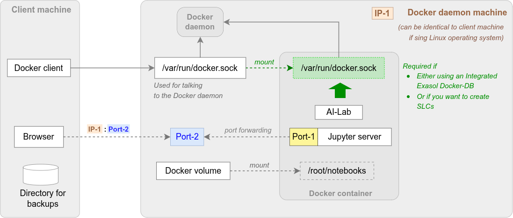

# Using Exasol AI-Lab Docker Edition

Using Exasol AI-Lab Docker Edition requires some specific prerequisites but also offers additional benefits.

## Need to Know About Docker Images and Containers

Exasol AI-Lab Docker Edition is published as a so-called _Docker Image_ on [Docker Hub](https://hub.docker.com/r/exasol/ai-lab).

In order to use such an image you need two components
* Docker client
* Docker service, aka. _Docker daemon_

The client usually runs on your local machine, the daemon can be on the same machine, a remote machine, or inside a virtual machine.

The Docker client provides commands to download and manage such Docker Images.
Running a Docker Image results in a so-called _Docker Container_.
A Docker Container will maintain a _state_, including file system contents and running processes.
The client can be used to start, stop, and remove Docker Containers.

While a container is running you can
* Connect to IP ports exposed by the container
* Open a shell inside the container to interact with the container's file system or processes running inside the container, see command [`docker exec`](https://docs.docker.com/engine/reference/commandline/container_exec/)

When removing the container, all its processes are stopped and all changes to its file system are discarded. When you start a new container using the same image then all changes will be lost and the contents of its file system will be identical as defined by the image.

Please see [Managing User Data](managing_user_data.md) for preserving changes in the Jupyter notebook files and the [Secure Configuration Storage](secure_configuration_storage.md), though.

## Prerequisites

Before using Exasol AI-Lab Docker Edition you need to meet the following prerequisites:
* On the machine you want to interact with (e.g. localhost)
  * A Docker client must be installed
* The daemon machine must
  * Run a Linux operating system
  * Run a Docker daemon accessible from the Docker client
  * Have sufficient disk space to host the Docker image (size 1-2 GB) and run the Docker container
  * Have a free IP port to enable accessing the Jupyter server inside the Docker container
    * When using Docker Desktop then docker will forward the port to its internal VM _and_ to your client machine as well. In this case the IP port must be free on both systems, see also https://docs.docker.com/desktop/networking/.



Please refer to the [Official Docker documentation](https://docs.docker.com) for installation and configuration.

Docker volumes and port forwarding apply only for the daemon machine and you need to access the ports via the IP of the daemon machine. An exception is described in https://docs.docker.com/desktop/networking/.

## Operating Systems and Setups

Docker technology is available for a variety of operating systems and in multiple editions itself.

When your local machine runs on Linux operating system then there are no specific restrictions besides the general [system requirements](../user_guide.md#system-requirements). In this case Exasol recommends to run the Docker daemon on the same machine to simplify the usage.

When your client is running on Windows or MacOSX then at least the daemon machine must run on Linux. Docker Desktop usually includes a Linux VM with the Docker daemon.

See the next section for a list of verified setups.

### Enabling Exasol AI-Lab to Use Docker Features

<!-- later on AI-Lab will be enhanced to create SLCs, as well. -->
Exasol AI-Lab can use Docker features itself to provide additional convenience and features, such as starting an Exasol Docker-DB on demand.

<!-- Client Binaries are omitted on purpose, possible on Linux -->
This is only possible when using
* Linux
* Windows Docker Desktop with WSL 2
* Windows Docker Desktop with a remote Docker daemon
* MacOSX Docker Desktop
* MacOSX Docker Desktop with a remote Docker daemon

Please note that enabling Exasol AI-Lab to use Docker features creates security risks. In particular code running inside the AI-Lab could create privileged containers, mount the filesystem of the machine running the Docker daemon, and gain root access to it. For details see https://jpetazzo.github.io/2015/09/03/do-not-use-docker-in-docker-for-ci/, section "The socket solution".

Section [Enable AI-Lab to Access the Docker Daemon](#enable-ai-lab-to-access-the-docker-daemon) shows the corresponding commandline options, for details see [Docker FAQ](https://docs.docker.com/desktop/faqs/general/#how-do-i-connect-to-the-remote-docker-engine-api).

## Defining Environment Variables

The Unix shell commands in the following sections will use some environment variables to make the commands portable and enable to adapt to your specific preferences while at the same time maintaining the ability to execute the commands verbatim without any change:
* Variable `VERSION` refers to the version of Exasol AI-Lab Docker Edition you want to use, alternativly you can use `latest`.
* Variable `VOLUME` is expected to contain the name of your Docker volume, see [Managing User Data](managing_user_data.md).
* Variable `LISTEN_IP` defines the range of IP-addresses allowed to connect to the forwarded Jupyter port.
  * `0.0.0.0` means all IP-addresses are allowed.
  * For local setups, we recommend `127.0.0.1`.
  * Please contact your IT department if there are security restrictions.

Here are some sample values &mdash; please change to your needs:

```shell
VERSION=0.2.0
LISTEN_IP=0.0.0.0
VOLUME=my-vol
```

## Starting a Docker Container from the Docker Image

The following command will
* Download the Docker image for the specified version `$VERSION` of the AI-Lab if not yet available in your Docker service
* Run a Docker container using this image
* Mount the volume `$VOLUME` to the directory `/root/notebooks` inside the container
  * If the volume does not exist yet, then it will be created automatically.
* Forward port `49494` on the daemon machine allowing connections from all IP addresses matched by `$LISTEN_IP`

```shell
docker run \
  --volume ${VOLUME}:/root/notebooks \
  --publish ${LISTEN_IP}:49494:49494 \
  exasol/ai-lab:${VERSION}
```

Additional options
* Add option `--detach` to run the container in the background but please note that the initial welcome message with instructions will be hidden then, see also command [`docker logs`](https://docs.docker.com/engine/reference/commandline/container_logs/).
* If port `49494` is not available on your daemon machine you can forward port `49494` of the Jupyter server in the Docker container to another port, e.g. `55555`, on the daemon machine with `--publish ${LISTEN_IP}:55555:49494`

### Enable AI-Lab to Access the Docker Daemon

Please see the limitations and security risks in section [Enabling Exasol AI-Lab to Use Docker Features](#enabling-exasol-ai-lab-to-use-docker-features).

Please note that
* Only file system objects on the daemon machine can be mounted. This applies to ordinary directories as well as `docker.sock`.

* On Windows mounting `docker.sock` only works with Docker Desktop with WSL 2.
```shell
docker run \
  --volume ${VOLUME}:/root/notebooks \
  --volume /var/run/docker.sock:/var/run/docker.sock \
  --publish ${LISTEN_IP}:49494:49494 \
  exasol/ai-lab:${VERSION}
```

## Connecting to Jupyter Service

When starting AI-Lab as Docker container the command line will display a welcome message showing connection instructions and a reminder to change the default password:

```
$ docker run --publish 0.0.0.0:$PORT:49494 exasol/ai-lab:$VERSION
Server for Jupyter has been started successfully.

You can connect with http://<host>:<port>

If using a Docker daemon on your local machine and did forward the
port to the same port then you can connect with http://localhost:49494.

┬ ┬┌─┐┌┬┐┌─┐┌┬┐┌─┐  ┬ ┬┌─┐┬ ┬┬─┐   ┬┬ ┬┌─┐┬ ┬┌┬┐┌─┐┬─┐  ┌─┐┌─┐┌─┐┌─┐┬ ┬┌─┐┬─┐┌┬┐ ┬
│ │├─┘ ││├─┤ │ ├┤   └┬┘│ ││ │├┬┘   ││ │├─┘└┬┘ │ ├┤ ├┬┘  ├─┘├─┤└─┐└─┐││││ │├┬┘ ││ │
└─┘┴  ─┴┘┴ ┴ ┴ └─┘   ┴ └─┘└─┘┴└─  └┘└─┘┴   ┴  ┴ └─┘┴└─  ┴  ┴ ┴└─┘└─┘└┴┘└─┘┴└──┴┘ o

The default password is "ai-lab".
To update the password, log in to the Docker container as the user root and run
    /root/jupyterenv/bin/jupyter-lab server password
```

Using an internet browser you then can connect to the Jupyter server running in the Docker container in order to follow the tutorials presented by a set of Jupyter notebooks, see [Connecting to Jupyter Service](../user_guide.md#connecting-to-jupyter-service).

For parameter `<host>`: If your daemon machine is identical to the machine your browser is running on then you can replace `<host>` by `localhost` otherwise please use the IP address of the daemon machine.

The following section explains how to log in to the Docker container to change settings, such as the default password.

## Login to the Docker container

To update the password you must log in to the Docker container.

First, you need to find out the container's ID. The following command shows the list of currently running Docker containers.

```shell
docker ps
```

Here is a sample output

```
CONTAINER ID   IMAGE     COMMAND        NAMES
1199447716d4   image:2   "entrypoint"   funny_rabbit
```

The following command enables you to log in as the user `root` to the specified container:

```shell
docker exec --user root -it ${CONTAINER_ID} bash
```

## Installing Additional Dependencies

In case you want to install additional dependencies for using them in your Jupyter notebooks, please
1. [Login to the Docker container](#login-to-the-docker-container)
2. Activate jupyterenv (see the instructions below)
3. Install dependencies via `pip install`

After logging in to the Docker container, the following example activates the jupyterenv and installs the library `stream-zip` from pypi:

```shell
source /root/jupyterenv/bin/activate
pip install --upgrade stream-zip
exit
```

Please note: Removing the docker container `docker rm <container>` will discard all dependencies that have been installed additionally.
