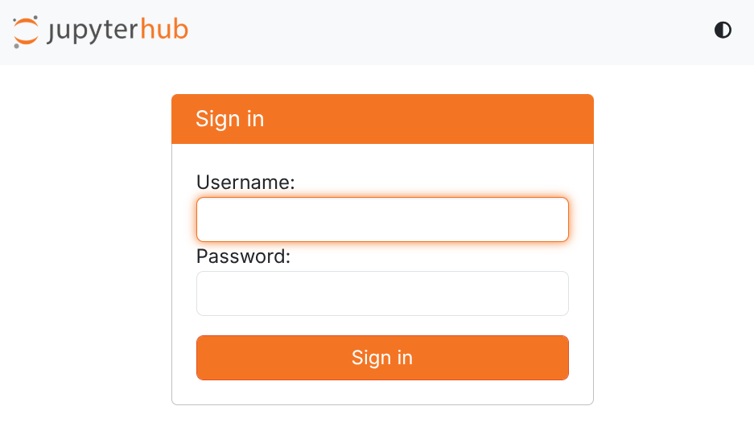
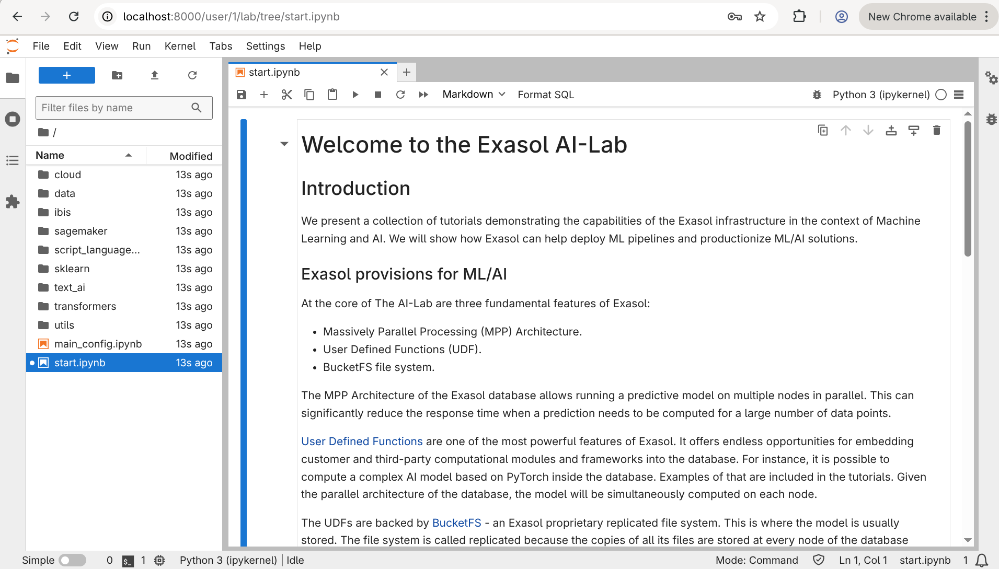

# AI Lab in a JupyterHub Environment

[JupyterHub](https://jupyter.org/hub) is a popular way to manage multi-user access 
to Jupyter environments. If your organization is using or planing to use JupyterHub to 
provide different groups of users access to the preconfigured Jupyter environments, you might 
find this document relevant.

This is not a complete detailed manual about JupyterHub setup and configuration - this topic is broad
and well beyond the scope of this document. In addition, support of JupyterHub in AI Lab is 
very experimental and you might encounter some issues and limitations. This document is rather 
a draft, describing how the AI Lab docker container can be integrated into the JupyterHub environment. 
Where needed, we provide links to the JupyterHub documentation for further reading.
If you face some problems, don't hesitate to file a [bug report](https://github.com/exasol/ai-lab/issues).

## Introduction

[Jupyter Project](https://jupyter.org/) inherently provides a single-user environment. 
Both Jupyter Notebook and the more recent Jupyter Lab use the credentials and environment of the 
user who started the process, without addressing scenarios in which multiple users must share 
resources provided by system administrators.

To mitigate this scenario, [JupyterHub](https://jupyter.org/hub) was created. At a high level,
it provides a web server that offers the following functionality:

* Authentication of users against preconfigured methods (PAM, OAuth, Kerberos, etc.)
* Allocation required resources (for example, starting virtual machines)
* Spawning Jupyter processes for users.
* Managing traffic between users and Jupyter processes.

Together they provide a convenient and flexible open-source tool, which allows administrators to build 
portals for corporate Jupyter users (for example, Data Science teams) or online courses (MOOCs).

A more detailed description of the JupyterHub architecture can be found in 
[A Conceptual Overview of JupyterHub](https://jupyterhub.readthedocs.io/en/stable/explanation/concepts.html) 
document.

## Custom AI Lab image

As the first step in AI Lab integration with JupyterHub, we need to create a custom AI Lab Docker Image, 
which has JupyterHub Python package installed in the AI Lab python environment.
This step is required, as JupyterHub needs to plug into the Jupyter environment and communicate with  
the running Jupyter processes inside the container.

To create a custom AI Lab image, create a file named `Dockerfile` with the following contents:

```dockerfile
FROM exasol/ai-lab:latest
USER root
RUN /home/jupyter/jupyterenv/bin/python3 -m pip install jupyterhub==5.2.1
USER ubuntu
ENTRYPOINT []
```

Then run the command `docker build -t exasol/ai-lab-hub:latest .` (note the dot at the end of the command).

After a couple of minutes, you should have the tagged image in your Docker:

```shell
$ docker images
REPOSITORY              TAG       IMAGE ID       CREATED              SIZE
exasol/ai-lab-hub       latest    8d20c95bc72a   5 seconds ago        3.94GB
```

## JupyterHub configuration

Now it is time to instruct JupyterHub on how to launch our AI Lab instance.
There are many options for how the Jupyter process can be started, but here we'll focus 
on a relatively simple scenario: starting the Docker container on the same machine
where JupyterHub is running.

In JupyterHub's terminology, to allocate resources and start Jupyter, a special entity 
called a "Spawner" is used. JupyterHub comes with many types of spawners, but in our 
case `DockerSpawner` is the most suitable. As its name suggests, it uses docker to 
run a specific instance each time a new user needs a Jupyter environment.

To set up the `DockerSpawner`, you need to add the following lines to the central JupyterHub 
configuration file `jupyterhub_config.py`:

```python
c.JupyterHub.spawner_class = "dockerspawner.DockerSpawner"
c.JupyterHub.hub_connect_ip = 'jupyterhub'
c.DockerSpawner.image = 'exasol/ai-lab-hub:latest'
c.DockerSpawner.network_name = 'jupyterhub'
c.DockerSpawner.remove = True
c.DockerSpawner.volumes = {"/var/run/docker.sock": "/var/run/docker.sock"}
c.DockerSpawner.default_url = "/lab/tree/start.ipynb"
c.DockerSpawner.cmd=["sudo", "-E", "python3", "/home/jupyter/entrypoint.py", "--notebook-defaults", "/home/jupyter/notebook-defaults", "--notebooks", "/home/jupyter/notebooks", "--home", "/home/jupyter", "--jupyter-server", "/home/jupyter/jupyterenv/bin/jupyterhub-singleuser", "--port", "8000", "--user", "jupyter", "--group", "jupyter", "--docker-group", "docker", "--password", "ailab", "--jupyter-logfile", "/home/jupyter/jupyter-server.log", "--venv", "/home/jupyter/jupyterenv"]
```

In the code above, we make the JupyterHub:
- use DockerSpawner as the default method to spawn the enviroment,
- specify the Docker image to use (the one we created in the previous step),
- define the docker network to connect to, 
- set the AI Lab URL to open after spawning the environment,
- instruct DockerSpawner to map the Docker socket into the container to allow the AI Lab to start new containers (which is needed for the Exasol DockerDB to work properly)
- specify the command to start inside the container.

More information about the configuration can be found details in the 
[JupyterHub configuration documentation](https://jupyterhub.readthedocs.io/en/stable/tutorial/getting-started/config-basics.html).

## Minimalistic example

In this section, we want to show the full working configuration of AI Lab running 
from Jupyter Hub. To simplify the configuration, we use the "dummy" JupyterHub authenticator,
which disables any credential checks. This scenario is not recommended for production use,
but it will give you a simple working prototype to start configuring JupyterHub in your
environment.

I assume that the step "Custom AI Lab Image" was completed and the Docker image was created 
in your Docker environment.

As the next step, you need to create the file `jupyterhub_config.py` with the following contents:

```python
c.JupyterHub.authenticator_class = "dummy"
c.JupyterHub.spawner_class = "dockerspawner.DockerSpawner"
c.JupyterHub.hub_ip = '0.0.0.0'
c.JupyterHub.hub_connect_ip = 'jupyterhub'
c.DockerSpawner.image = 'exasol/ai-lab-hub:latest'
c.DockerSpawner.network_name = 'jupyterhub'
c.DockerSpawner.remove = True
c.DockerSpawner.volumes = {"/var/run/docker.sock": "/var/run/docker.sock"}
c.DockerSpawner.default_url = "/lab/tree/start.ipynb"
c.DockerSpawner.cmd=["sudo", "-E", "python3", "/home/jupyter/entrypoint.py", "--notebook-defaults", "/home/jupyter/notebook-defaults", "--notebooks", "/home/jupyter/notebooks", "--home", "/home/jupyter", "--jupyter-server", "/home/jupyter/jupyterenv/bin/jupyterhub-singleuser", "--port", "8000", "--user", "jupyter", "--group", "jupyter", "--docker-group", "docker", "--password", "ailab", "--jupyter-logfile", "/home/jupyter/jupyter-server.log", "--venv", "/home/jupyter/jupyterenv"]
import logging

c.JupyterHub.log_level = logging.DEBUG
c.DockerSpawner.debug = True
```

It is mostly identical to the configuration from the previous section, with additional lines 
changing the log level, specifying the authenticator, and setting the JupyterHub listen address.

Then, in the same directory as the `jupyterhub_config.py` file, you need to create the file `Dockerfile`
with the following contents:

```dockerfile
ARG JUPYTERHUB_VERSION=5.2.1
FROM jupyterhub/jupyterhub:$JUPYTERHUB_VERSION
COPY requirements.txt /tmp/requirements.txt
RUN python3 -m pip install --no-cache dockerspawner jupyterhub-dummyauthenticator
COPY jupyterhub_config.py /srv/jupyterhub/jupyterhub_config.py
```

It takes the JupyterHub base image, adds the configuration we created, and installs additional packages
for JupyterHub.

Once this is done, you're ready to start JupyterHub on your machine:
1. Build the image with the command `docker build -t hub .` (note the dot at the end of the commend)
2. Create the Docker network with the command `docker network create jupyterhub`
3. Run the Docker container with the command `docker run --rm -it -v /var/run/docker.sock:/var/run/docker.sock --net jupyterhub --name jupyterhub -p8000:8000 hub`

If everything is done correctly, after a couple of minutes you will see the following messages
in the terminal:

```text
...
[I 2025-09-19 07:43:37.866 JupyterHub proxy:477] Adding route for Hub: / => http://jupyterhub:8081
[D 2025-09-19 07:43:37.866 JupyterHub proxy:925] Proxy: Fetching POST http://127.0.0.1:8001/api/routes/
07:43:37.870 [ConfigProxy] info: Adding route / -> http://jupyterhub:8081
07:43:37.871 [ConfigProxy] info: Route added / -> http://jupyterhub:8081
07:43:37.872 [ConfigProxy] info: 201 POST /api/routes/ 
[I 2025-09-19 07:43:37.873 JupyterHub app:3770] JupyterHub is now running at http://:8000
[D 2025-09-19 07:43:37.874 JupyterHub app:3339] It took 0.791 seconds for the Hub to start
```

After that, you can open the address [http://localhost:8000]() in your browser, which should
show you a user and password prompt.



As we configured JupyterHub to use the dummy authenticator, you can enter any name/password pair here 
and press the "Sign in" button. After a short delay, the AI Lab start page should be shown:



As you can see, the user name (in my case, "1") was added to the URL, so different users can 
use the system without affecting each other.

## Limitations 

The above method allows you to integrate AI Lab into a new or existing JupyterHub environment.
But at the moment, there is a limitation: if the Exasol DockerDB is used inside AI Lab, only one 
instance of the DB can be started on the same machine. This happens because of the strict naming of this 
instance, so any attempt to start a second DockerDB instance will fail.

We have plans to solve this limitation, and you can check the status of 
[this issue](https://github.com/exasol/ai-lab/issues/410) on the GitHub page.
