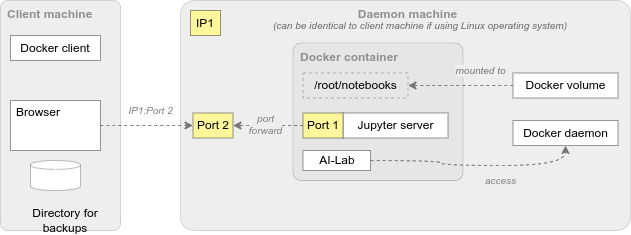

## Prerequisites for Using AI-Lab Docker Edition

Before using Exasol AI-Lab Docker Edition you need to meet the following prerequisites:
* On the machine you want to interact with (e.g. localhost)
  * A Docker client must be installed
* The daemon machine must
  * Run a Linux operating system
  * Run a Docker daemon accessible from the Docker client
  * Have sufficient disk space to host the Docker image (size 1-2 GB) and run the Docker container
  * Have a free IP port to enable accessing the Jupyter server inside the Docker container
    * When using Docker Desktop, it will forward the port to its internal VM _and_ to your client machine as well. In this case the IP port must be free on both systems, see also https://docs.docker.com/desktop/networking/.

Please refer to the [Official Docker documentation](https://docs.docker.com) for installation and configuration.

Docker volumes and port forwarding apply only for the daemon machine and you need to access the ports via the IP of the daemon machine. An exception is described in https://docs.docker.com/desktop/networking/.
