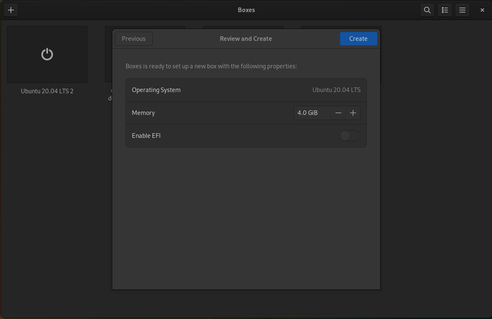
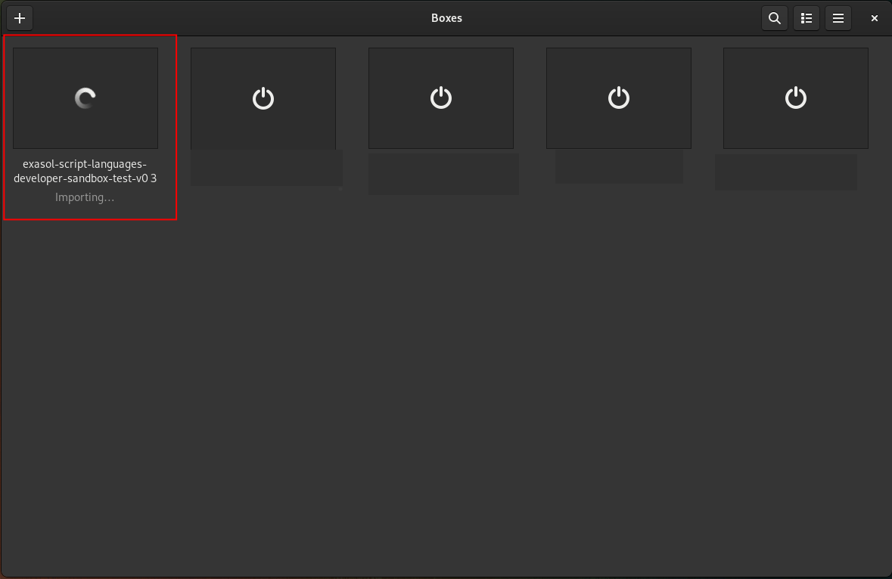
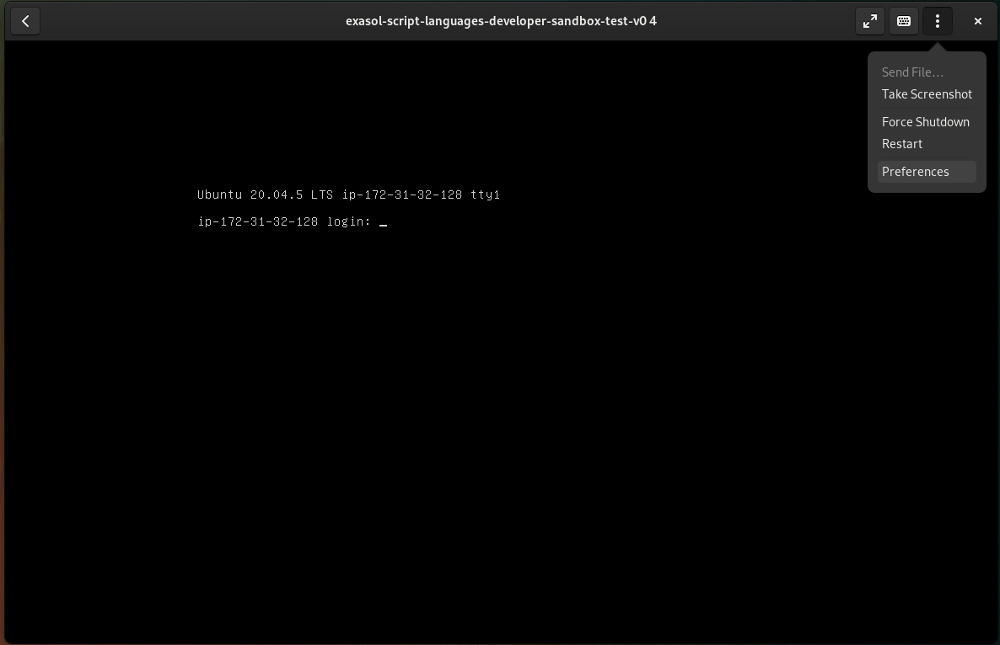
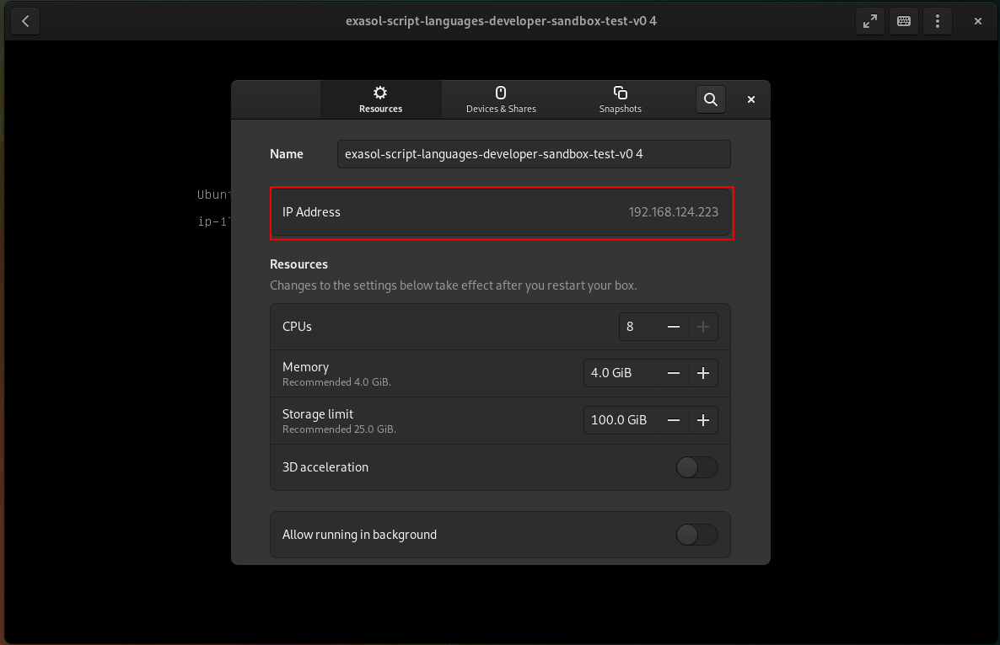

# Script-Languages-Developer-Sandbox User Guide

## Overview

This project aims to create a virtual machine image, in different formats, which can be used to easily build Exasol's script-languages-container, which are the runtime container for UDF's.

The virtual machine image provides:
* The script-languages-release repositories
* All necessary dependencies to execute _exaslct_ in script-languages-release (This includes a correctly configured docker runtime)
* A running Jupyterlab instance which is automatically started during boot of the vm

## Objective

The objective is to have a complete VM ready, including all dependencies, which can be used as base to customize the existing template script-languages-container (e.g. python-3.x-minimal templates, the r-minimal templates); or, if needed, to create new script-languages-container from scratch.
The disk of the VM is per default large enough to build and test script-languages-container.

## Provided media

### AMI

The AMI id is linked in the [release notes](https://github.com/exasol/script-languages-developer-sandbox/releases/latest) and can be used to start an EC2-instance in your AWS account.
Following name format is used for the AMI: "_Exasol-SLC-Developer-Sandbox-**version**_", e.g. "_Exasol-SLC-Developer-Sandbox-5.0.0_"

### VM image

Currently two VM formats are supported:

| Format      | Description                       |
| ----------- | --------------------------------- |
| VMDK        | VMware Virtual Machine Disk       |
| VHD         | Virtual Hard Disk by Microsoft    |

The links to the images are stored in the release notes.  

## Usage

### HW requirements

We recommend the following requirements for the VM instance:

| Type | Minimum | Recommended |
|------|---------|-------------|
| RAM  | 2GB     | 8GB         |
| CPU  | 1 Core  | 2 Cores     |

### Use the AMI

#### Overview

1. Create a Security Group with open inbound ports for `ssh` (22) and `Jupyter` (8888)
2. Starter the EC-2 instance

#### Step-by-step

1. Go to [AWS Console](https://aws.amazon.com/console/)
2. Go to EC2 (in the search field at the top type EC2 and click on the result)
3. Create a security group for ssh and (optionally) Jupyter:
    - In the navigation bar on the left select "Security Groups"
    - Click button "Create Security Group"
    - Choose name and VPC
    - For outbound rules keep the default
    - Create  inbound rules: 
      - One of type `ssh`
      - If you plan to connect to the Jupyter lab, add another rule of type "Custom TCP" with port 8888. 
        - **Important**: With this rule you expose the Jupyter lab to the internet; anybody who has access to the password will be able to execute commands. For a minimum of security you should change the default Jupyter password. Details about how to do that will be shown in the login screen. However, you should consider to use only `ssh` with port forwarding.
 4. Go back to the EC2 console
 5. Launch the EC2 instance:
     - In the navigation bar on the left select "Instances"
     - Click button "Launch instances"
     - At field "Application and OS Images" select the AMI id of the developer sandbox (found in the [release notes](https://github.com/exasol/script-languages-developer-sandbox/releases/latest))
     - Select an appropriate instance type (at least "t2.small" or similar)
     - Choose your key pair
     - Choose the security group which your created in step 3.
     - For the storage we recommend to keep the pre-selected 100GB volume
     - Click button "Launch instance"
6. As soon as the machine becomes available you can connect per ssh with user `ubuntu`: `ssh -i your_key.pem ubuntu@the_new_ec_instance`

### Use the virtual machine image

#### Boxes (QEMU) under Linux

##### Overview

1. Open the `VMDK` image
2. Select Ubuntu 20.04 LTS as template
3. Configure RAM
4. Start the VM

##### Step-by-step

1. Download the `VMDK` file from the [release notes](https://github.com/exasol/script-languages-developer-sandbox/releases/latest).
2. Open Boxes
3. Create a new VM: Click the + Button
4. Choose: "Create virtual machine from file"

5. Select the downloaded "VMDK" file from step 1
6. Select "Ubuntu 20.04 LTS" as Template, and click "Next"

7. Select memory size (see section Hardware Requirements), then click "Create"

8. The image will be imported and then will automatically start

9. See section [Login](#Login) about how to login
10. If you want to connect to the Jupyterlab, you need to find out the IP address of the VM:
- Click the 3 dots in Boxes, then preferences
- Then the IP address will be shown: 
- Use _IP-Address_:8888 to connect to the [Jupterlab](#Jupyter) 

### Login

Username: **ubuntu**

At the first login to the sandbox (image or AMI) you will be prompted to change your password.  
The default password is: **scriptlanguages**

However, we suggest to use ssh-keys for the connection. When you use the AWS AMI, this will work automatically. When you use the VM images, you need to deploy your ssh-keys. After you enabled ssh-keys, we recommend to disable ssh password authentication:
```shell
sudo sed -i "s/PasswordAuthentication yes/PasswordAuthentication no/g" /etc/ssh/sshd_config
sudo systemctl restart ssh.service
```

Also, we strongly recommend to change the Jupyter password as soon as possible. Details about how to do that will be shown in the login screen.

## Content

### script-languages-release

**Location**: `/home/ubuntu/script-languages-release`  
**Source**: [Github repo](https://github.com/exasol/script-languages-release)  
The images are tightly coupled to the releases of script-languages-release; for each release of the script-languages-release there will be a release of the developer sandbox.  
By default, the images contain a cloned repository of script-languages-container, including all dependencies to run it (Python, Poetry, Docker, etc.). The checked out version will be the tag of the respective release, e.g. a Developer Sandbox image for release 5.0.0 will have the tag 5.0.0 checked out for script-languages-release.  
If you aim to customize existing containers, this should be fine. However, if you want to rebuild a container, you might encounter problems as dependant packages might have changed. In that case, we suggest to check out the master branch
```shell
git checkout --recurse-submodules master
```

For information about how to build script-languages-container please check:
- [SLC User Guide](https://github.com/exasol/script-languages-release/blob/master/doc/user_guide/user_guide.md) - Infos about the container
- [exaslct User Guide](https://github.com/exasol/script-languages-container-tool/blob/main/doc/user_guide/user_guide.md) - Details about the build tool

### Jupyter

**Location virtual environment**: `/home/ubuntu/jupyterenv`  
**Location notebooks**: `/home/ubuntu/notebooks`  
**Password**: `script-languages`  
**Http Port**: 8888  

There is a pre-loaded tutorial notebook available which guides you through the usage of `exaslct`:  __script-languages.ipynb__.

Check [Jupyter Home](https://jupyter.org/) for more information.
