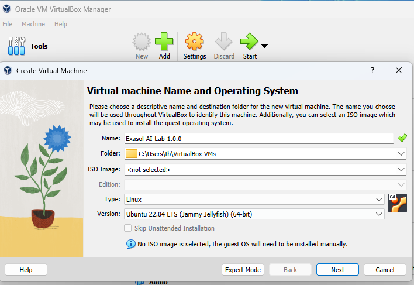
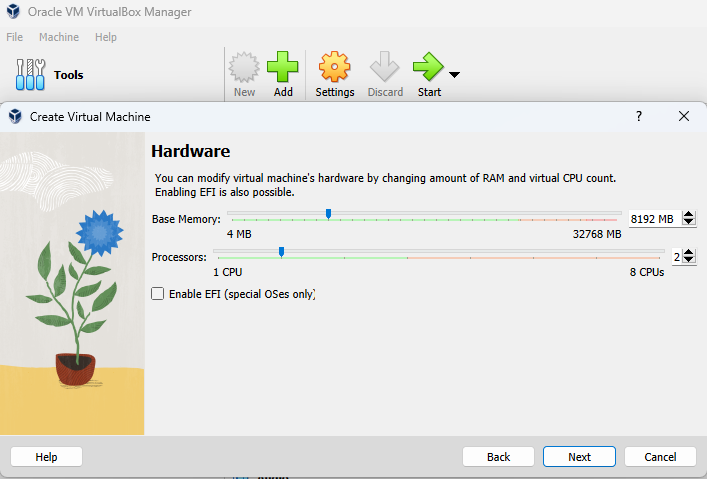
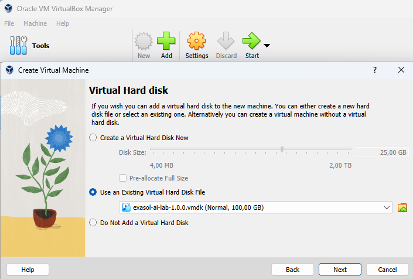
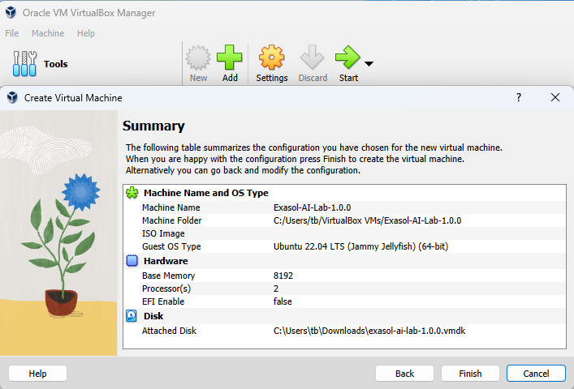
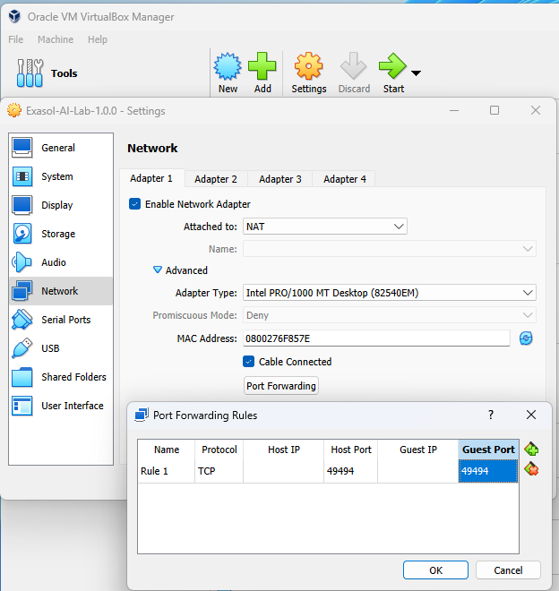
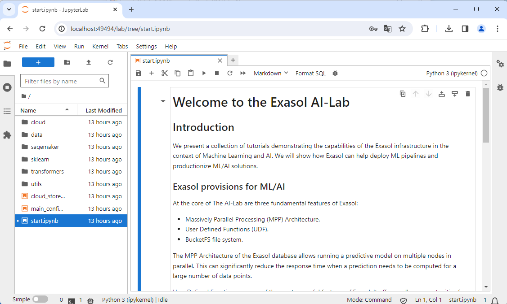

# Importing image format VMDK into Oracle Virtual Box on Windows

## Preparation

* [Download the VMDK image file](https://github.com/exasol/ai-lab/releases) for the latest version of the AI-Lab VM Edition
* Download Oracle Virtual Box
* Start Windows application _Oracle Virtual Box_

## Select Virtual machine Name and Operating System

* Create a new virtual machine
* Enter a name for your virtual machine, e.g. "Exasol-AI-Lab-2.0.0"
* Select a folder to store the VM image to
* Select operating system "Linux", e.g. version "Ubuntu 22.04"
* Click button "Next"

## Select Hardware

* Select Base Memory &gt; 8000 MB
* Select &gt; 2 CPUs
* Click button "Next"

## Select  Virtual Hard disk

* Select "Use an Existing Virtual Hard Disk File"
* Select the path to the AI-Lab vmk image file

## Review Summary

## Adjust Network Settings in Oracle Virtual Box Manager

* Check "Enable Network Adapter"
* For "Attached to" select "NAT"
* Select your Adapter Type, MAC Address, and maybe "Cable Connected"
* Click button "Port Forwarding"
* Forward port 49494 or the virtual machine to the same or any other free port on your Host machine

## Run the Virtual Machine

