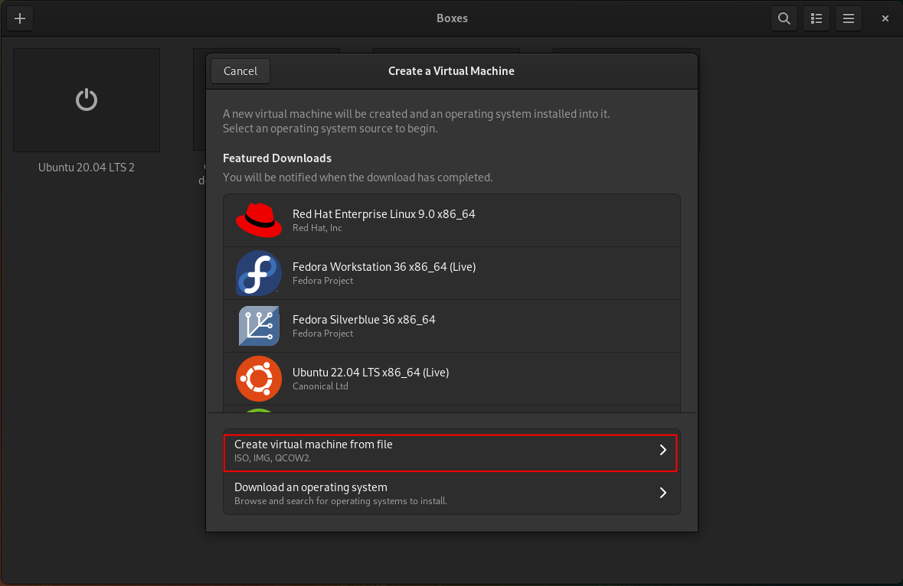
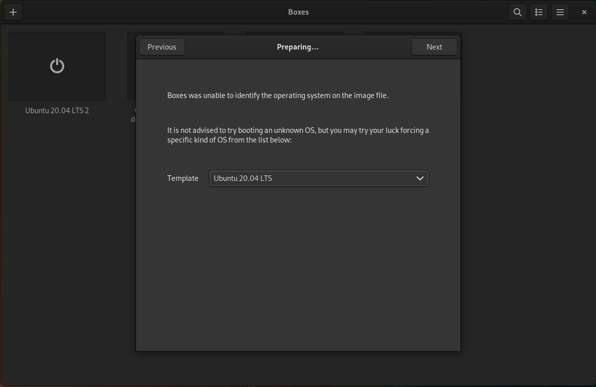

# AI-Lab Virtual Machine Edition

The AI-Lab Virtual Machine Edition offers two different VM images
* VMware Virtual Machine Disk (VMDK)
* Virtual Hard Disk by Microsoft (VHD)

The following table shows which Hypervisor supports which image formats:

| Hypervisor          | VMDK | VHD |
|---------------------|------|-----|
| VMWare work station | yes  | ?   |
| Virtual box         | yes  | yes |
| Hyper-V             | ?    | yes |
| WSL 2               | ?    | ?   |

Notes for Hypervisors based on KVM/[QEMU](https://en.wikipedia.org/wiki/QEMU):
* There multiple alternative UIs, see https://en.wikipedia.org/wiki/Libvirt#User_Interfaces.
* File in format VHD or VMDK needs to be converted first, see
  * https://docs.openstack.org/image-guide/convert-images.html
   * https://linux.die.net/man/1/qemu-img

## Boxes (QEMU) on Linux operating system

### Overview

1. Open the `VMDK` image
2. Select Ubuntu 20.04 LTS as template
3. Configure RAM
4. Start the VM

### Step-by-step

1. Download the `VMDK` file from the [release notes](https://github.com/exasol/ai-lab/releases/latest).
2. Open Boxes
3. Create a new VM: Click the + Button
4. Choose: "Create virtual machine from file" 

5. Select the downloaded "VMDK" file from step 1
6. Select "Ubuntu 20.04 LTS" as Template, and click "Next"

7. Select memory size (see section Hardware Requirements), then click "Create"

8. The image will be imported and then will automatically start

9. See section [Login](#login) about how to login
10. If you want to connect to the Jupyterlab, you need to find out the IP address of the VM:
- Click the 3 dots in Boxes, then preferences 

- Then the IP address will be shown: 

- Use _IP-Address_:49494 to connect to the [Jupterlab](jupyter.md#open-jupyter-in-your-browser)

## Login

See [Login to AMI and VM Editions](login-vm-and-ami.md) for logging in to the system.
