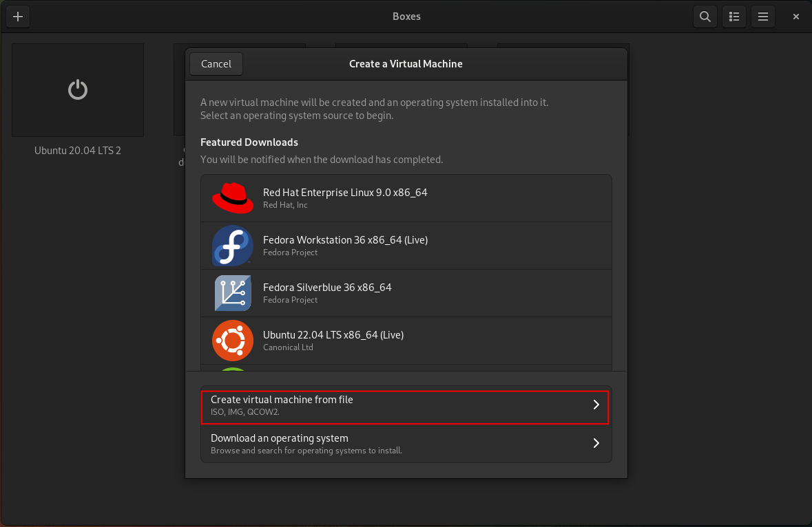
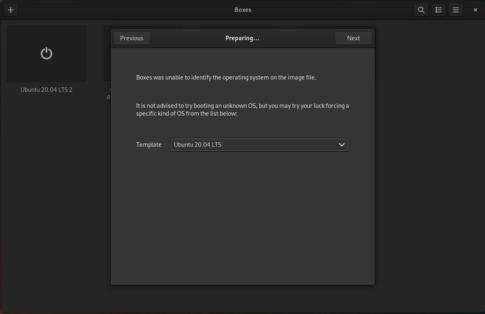
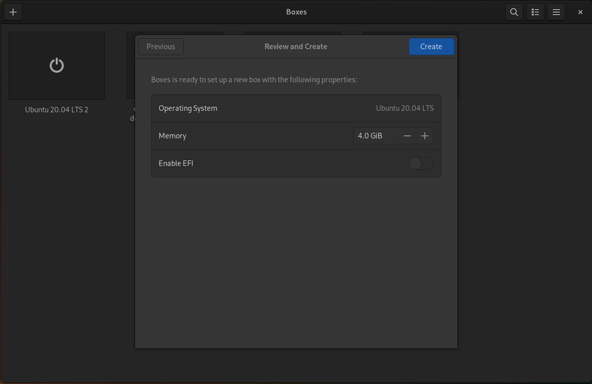
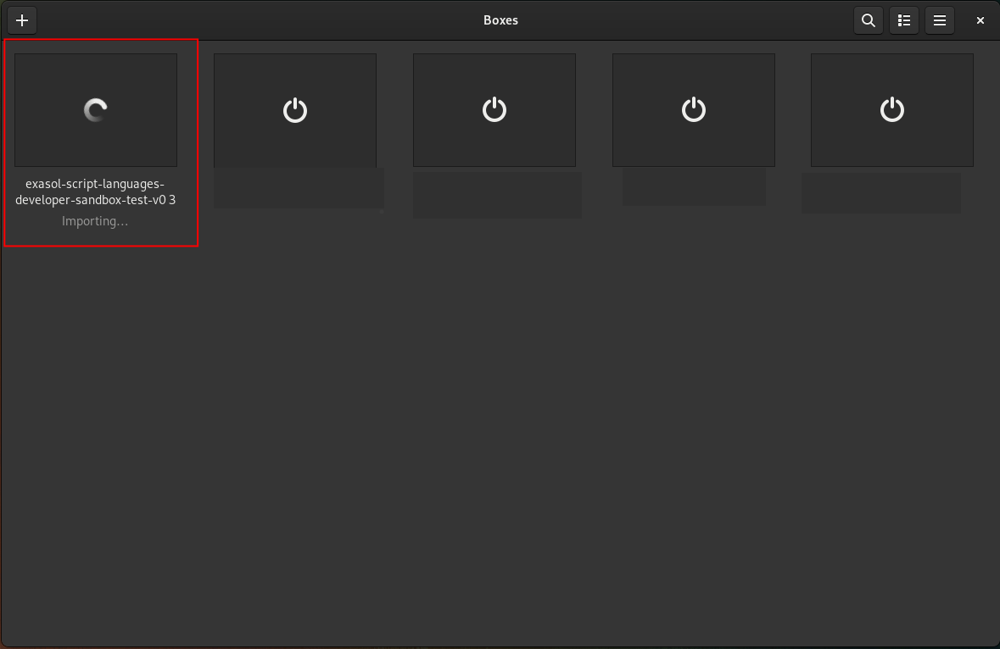
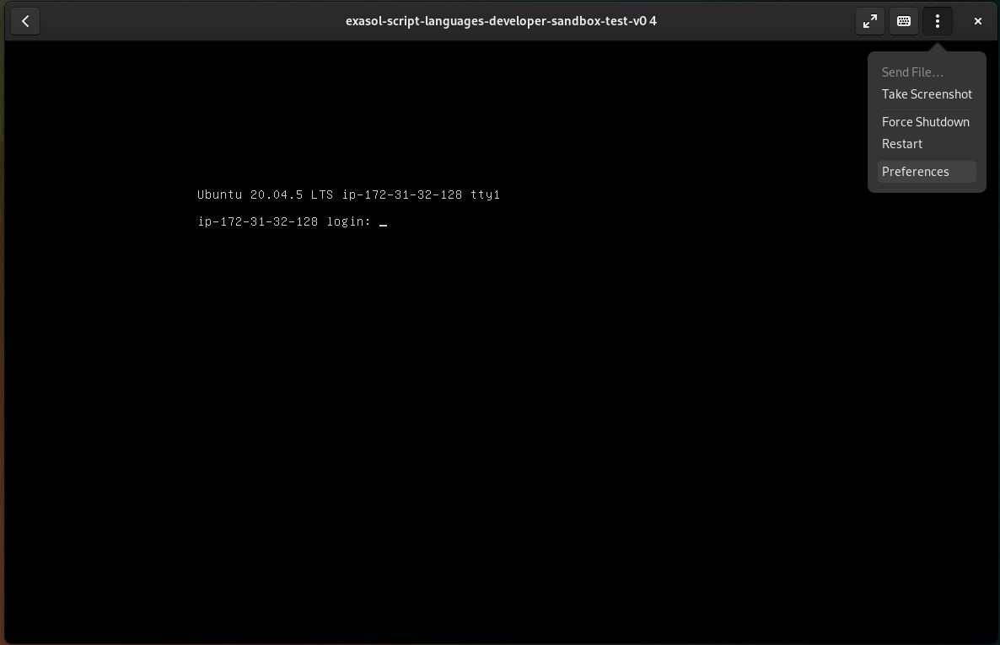
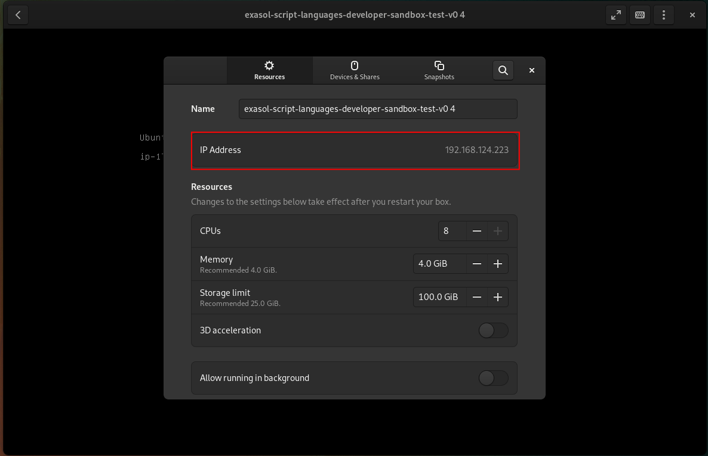

# Using a virtual machine image (VMDK or VHD)

## Boxes (QEMU) on Linux operating system

### Overview

1. Open the `VMDK` image
2. Select Ubuntu 20.04 LTS as template
3. Configure RAM
4. Start the VM

### Step-by-step

1. Download the `VMDK` file from the [release notes](https://github.com/exasol/data-science-sandbox/releases/latest).
2. Open Boxes
3. Create a new VM: Click the + Button
4. Choose: "Create virtual machine from file" 

5. Select the downloaded "VMDK" file from step 1
6. Select "Ubuntu 20.04 LTS" as Template, and click "Next"

7. Select memory size (see section Hardware Requirements), then click "Create"

8. The image will be imported and then will automatically start

9. See section [Login](#Login) about how to login
10. If you want to connect to the Jupyterlab, you need to find out the IP address of the VM:
- Click the 3 dots in Boxes, then preferences 

- Then the IP address will be shown: 

- Use _IP-Address_:49494 to connect to the [Jupterlab](#Jupyter)
